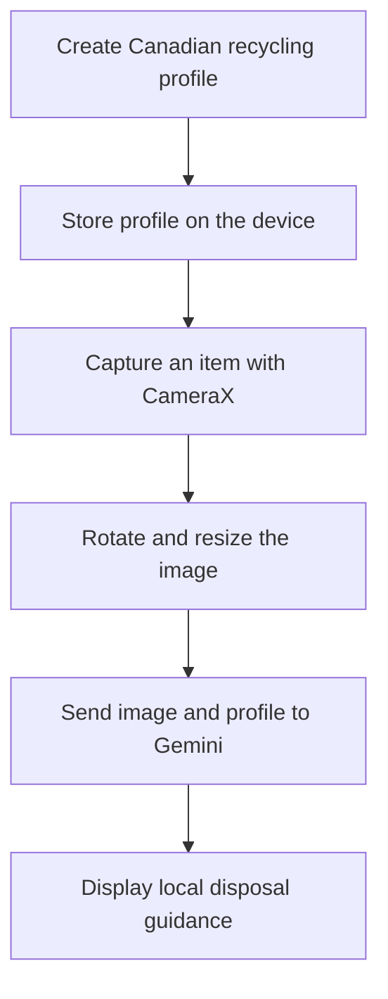

<div align="center">

♻️ Local Eco-Scanner

Location-aware recycling guidance from a single photo

[](https://developer.android.com/)
[](https://kotlinlang.org/)
[](https://developer.android.com/compose)
[](https://developer.android.com/tools/releases/platforms)
[](#project-status)

Local Eco-Scanner is a native Android application that uses the device camera and Google Gemini to identify a household item and provide practical recycling, disposal, and upcycling guidance tailored to the user's Canadian municipality and residence type.

</div>

[!IMPORTANT]
The app provides AI-generated guidance, not official municipal instructions. Recycling programs can change, and users should verify uncertain or safety-critical disposal rules with their municipality.

## Table of contents

- [Overview](#overview)
- [Key features](#key-features)
- [How it works](#how-it-works)
- [Technology stack](#technology-stack)
- [Requirements](#requirements)
- [Getting started](#getting-started)
- [Using the app](#using-the-app)
- [Project structure](#project-structure)
- [Implementation notes](#implementation-notes)
- [Permissions, privacy, and security](#permissions-privacy-and-security)
- [Testing](#testing)
- [Project status](#project-status)
- [Current limitations](#current-limitations)
- [Roadmap](#roadmap)
- [Contributing](#contributing)
- [License](#license)
- [Author](#author)

## Overview

Recycling rules differ across Canadian municipalities and may also depend on a resident's housing type. Local Eco-Scanner combines image understanding with a saved local profile to make disposal advice more relevant than a generic object-classification result.

After the user photographs an item, the app asks Gemini to:

1. Identify the object and its likely material.
2. Determine whether it is recyclable in the user's local context.
3. Recommend the most appropriate disposal stream.
4. Suggest practical preparation or disposal steps.
5. Provide creative upcycling ideas.

Every successful scan is organized into three sections:

- **Is it Recyclable?**
- **Proper Disposal Steps**
- **Creative Upcycling Ideas**

## Key features

- **Camera-based item scanning** using a live CameraX preview and rear-camera capture.
- **Multimodal AI analysis** powered by the `gemini-2.5-flash` model.
- **Canada-specific onboarding** covering all provinces and territories.
- **Location-aware prompting** using province or territory, municipality, postal code, and residence type.
- **Canadian postal-code validation** with automatic uppercase formatting.
- **Residence-specific context** for houses, apartments, condos, co-ops, and other housing types.
- **Local profile persistence** with private Android `SharedPreferences`.
- **Image preprocessing** that corrects camera rotation and limits the longest image dimension to 1600 pixels before upload.
- **Structured result presentation** in a scrollable Material 3 bottom sheet.
- **Clear permission and error states**, including a route to Android settings when camera permission cannot be requested again.
- **Municipal-verification reminders** when the AI cannot confidently establish a current local rule.

## How it works



### Scan lifecycle

1. **Profile setup** — On first launch, the user selects a province or territory, enters a municipality and postal code, and chooses a residence type.
2. **Local storage** — The completed profile is saved on the device and restored on later launches.
3. **Camera permission** — The app requests camera access only after profile setup is complete.
4. **Photo capture** — CameraX captures the item from the default rear-facing camera.
5. **Image preparation** — The app corrects the image orientation and downscales large photos to reduce upload size.
6. **AI analysis** — The image and recycling profile are sent to Gemini with instructions to avoid inventing municipal rules, schedules, bin colours, fees, or facilities.
7. **Result display** — The photographed item and structured guidance appear in a bottom sheet, with an option to scan another item.

## Technology stack

| Area | Technology | Repository version/configuration |
| --- | --- | --- |
| Language | Kotlin | 2.3.20 |
| UI | Jetpack Compose + Material 3 | Compose BOM 2026.06.01 |
| Camera | CameraX Core, Camera2, Lifecycle, View | 1.6.1 |
| AI | Google Generative AI Android SDK | 0.9.0 |
| Model | Google Gemini | `gemini-2.5-flash` |
| Concurrency | Kotlin coroutines | Android lifecycle runtime integration |
| Local storage | Android `SharedPreferences` | Private application preferences |
| Build system | Gradle Kotlin DSL + Version Catalog | Gradle 8.13 / AGP 8.13.2 |
| JVM target | Java 17 | Source and target compatibility 17 |
| Android SDK | Android SDK | Minimum 24, target 36, compile 36 |

## Requirements

Before building the project, ensure you have:

- A recent version of [Android Studio](https://developer.android.com/studio) compatible with the configured Android Gradle Plugin.
- JDK 17.
- Android SDK 36 installed.
- An Android device or emulator running Android 7.0 (API 24) or newer.
- A rear-facing or emulated back camera.
- Internet access on the Android device.
- A valid [Gemini API key](https://ai.google.dev/gemini-api/docs/api-key).

## Getting started

### 1. Clone the repository

```bash
git clone https://github.com/naramritvij/LocalEcoScanner.git
cd LocalEcoScanner
```

### 2. Add the Gemini API key

Open the project in Android Studio and add the following entry to the project-level `local.properties` file:

```properties
GEMINI_API_KEY=your_gemini_api_key_here
```

If `local.properties` already contains an `sdk.dir` entry, keep it and add the API key on a new line. The file is excluded by the repository's `.gitignore`; never commit a real API key.

The build configuration exposes the value to the application as:

```kotlin
BuildConfig.GEMINI_API_KEY
```

### 3. Sync the project

In Android Studio, select **File → Sync Project with Gradle Files** and allow the required SDK components and dependencies to install.

### 4. Build the debug APK

On macOS or Linux:

```bash
./gradlew assembleDebug
```

If the wrapper is not executable after cloning, run `chmod +x gradlew` once or invoke it with `bash gradlew assembleDebug`.

On Windows:

```powershell
gradlew.bat assembleDebug
```

The generated APK will be available at:

```text
app/build/outputs/apk/debug/app-debug.apk
```

### 5. Run the app

Connect a compatible Android device or start an emulator with a configured back camera, then either:

- Select the `app` run configuration in Android Studio and click **Run**; or
- Install from the command line with `./gradlew installDebug` (`gradlew.bat installDebug` on Windows).

## Using the app

1. Select your Canadian province or territory.
2. Enter your city or municipality.
3. Enter a valid Canadian postal code.
4. Choose your residence type and save the profile.
5. Grant camera access when prompted.
6. Center one item clearly inside the scanner frame.
7. Tap the capture button and wait for analysis.
8. Review the recycling decision, disposal steps, and upcycling ideas.
9. Verify any uncertain local rule with your municipality.
10. Tap **Scan Another Item** to return to the camera.

For better results, photograph one item at a time in good lighting, keep the full object visible, and avoid cluttered backgrounds.

## Project structure

LocalEcoScanner/
├── app/
│   ├── build.gradle.kts                  # Android app configuration and API-key injection
│   ├── proguard-rules.pro                # Release shrinker configuration
│   └── src/
│       ├── main/
│       │   ├── AndroidManifest.xml        # Permissions, camera requirement, launcher activity
│       │   ├── java/com/example/localecoscanner/
│       │   │   ├── MainActivity.kt        # App state, UI, CameraX, Gemini, and persistence
│       │   │   └── ui/theme/              # Generated Compose theme resources
│       │   └── res/                       # Icons, strings, colours, themes, and backup rules
│       ├── test/                          # Local JVM tests
│       └── androidTest/                   # Instrumented Android tests
├── gradle/
│   ├── libs.versions.toml                 # Central dependency and plugin versions
│   └── wrapper/                           # Gradle wrapper configuration
├── build.gradle.kts                       # Root build configuration
├── settings.gradle.kts                    # Repositories and module registration
└── gradle.properties                      # Shared Gradle settings

## Implementation notes

### Application design

The current MVP uses a single-activity, Compose-first design. Most application behavior is intentionally consolidated in `MainActivity.kt`:

| Component | Responsibility |
| --- | --- |
| `EcoScannerApp` | Owns Compose state and coordinates setup, permissions, capture, analysis, and results |
| `LocationSetupScreen` | Collects and validates the local recycling profile |
| `ScannerScreen` | Displays the camera preview, scanner frame, controls, loading state, and errors |
| `CameraPreview` | Binds CameraX preview and image-capture use cases to the activity lifecycle |
| `analyzeWithGemini` | Builds the local prompt and performs multimodal Gemini analysis on an I/O dispatcher |
| `ResultSheetContent` | Presents the captured image, location context, AI response, and disclaimer |
| `saveRecyclingLocation` / `loadRecyclingLocation` | Persists the profile with `SharedPreferences` |
| `rotateBitmap` / `downscaleBitmap` | Prepares captured images before remote analysis |

### AI prompt behavior

The prompt asks Gemini to identify the item and likely material, then recommend one of the relevant disposal streams when possible, including:

- Curbside recycling
- Garbage
- Organics
- Hazardous waste
- Depot or drop-off
- Donation
- Special collection

It also directs the model not to invent collection schedules, bin colours, accepted materials, drop-off locations, fees, or municipal regulations. When the exact rule cannot be established confidently, the expected response is **“Verify with your municipality.”**

### Image handling

- Captures use `CAPTURE_MODE_MINIMIZE_LATENCY`.
- Camera metadata is used to correct image rotation.
- Images whose largest dimension exceeds 1600 pixels are proportionally downscaled.
- The processed bitmap is held in memory for the current result and is not written to a local image file by the application.

## Permissions, privacy, and security

### Android permissions

| Permission | Purpose |
| --- | --- |
| `android.permission.CAMERA` | Display the live preview and photograph an item |
| `android.permission.INTERNET` | Send the scan request to the Gemini API |

The manifest marks camera hardware as required, so devices without a compatible camera may be filtered from installation.

### Data handling

- The recycling profile is stored locally in the app's private `SharedPreferences`.
- During a scan, the processed image, province or territory, municipality, postal code, and residence type are sent to the Gemini API for analysis.
- The current implementation does not maintain a scan-history database or save captured photos to a local file.
- Users should review Google's applicable Gemini API terms and data-handling policies before using or distributing the app.

### API-key security

`local.properties` prevents accidental source-control commits, but the configured API key is compiled into `BuildConfig` and can potentially be recovered from an APK. This approach is appropriate for local development and prototyping, not for distributing an unrestricted production credential.

Before a production release, route Gemini requests through a secured backend or another approved credential-broker pattern, apply quotas and monitoring, and rotate any key that may have been exposed.

## Testing

Run local unit tests with:

```bash
./gradlew test
```

Run instrumented tests on a connected device or emulator with:

```bash
./gradlew connectedAndroidTest
```

On Windows, replace `./gradlew` with `gradlew.bat`.

The repository currently contains the default example unit and instrumented tests. Production-quality coverage should add tests for postal-code normalization and validation, profile persistence, permission states, camera failures, prompt construction, loading/error transitions, and result rendering.

## Project status

Local Eco-Scanner is a **functional MVP**. The core onboarding, camera capture, image processing, Gemini integration, and result experience are implemented. The current codebase is suitable for demonstration and continued development, but the security and official-data limitations below should be addressed before production distribution.

## Current limitations

- Guidance is intended for Canadian locations only.
- Municipal context is user-entered and is not validated against an official municipality directory.
- The AI is prompted with local context but is not grounded in a live, authoritative municipal recycling dataset.
- Results may contain object-identification or disposal errors and should not be treated as official instructions.
- Scanning requires an internet connection and a functioning Gemini API key.
- Only the default rear camera is supported; gallery import and camera switching are not implemented.
- Scan history, favourites, sharing, and offline analysis are not implemented.
- Most application logic currently resides in one large activity file.
- The direct client-side API-key approach is not suitable for an unrestricted production release.
- Automated tests are currently placeholders rather than meaningful feature coverage.

## Roadmap

- [ ] Ground recommendations in current, official municipal sources and show source links.
- [ ] Move Gemini access behind a secured backend and add quota protection.
- [ ] Separate UI, state, domain logic, persistence, and AI access into testable layers.
- [ ] Introduce a `ViewModel` and lifecycle-aware screen state.
- [ ] Add scan history, saved items, sharing, and optional photo import.
- [ ] Add retry and connectivity-aware error handling.
- [ ] Add unit, Compose UI, and CameraX integration tests.
- [ ] Improve accessibility, localization, and dynamic-theme support.
- [ ] Add app screenshots, demo media, and release automation.

## Contributing

Contributions and suggestions are welcome.

1. Fork the repository.
2. Create a focused branch: `git checkout -b feature/your-feature`.
3. Make and test your changes.
4. Commit with a clear message.
5. Push the branch and open a pull request describing the problem, solution, and testing performed.

Please do not include API keys, personal location data, generated build outputs, or IDE-specific workspace files in a contribution.

## License

No license file is currently included in this repository. Until a license is added, copyright remains with the repository owner and reuse or redistribution rights are not automatically granted.

## Author

Developed by **Ritvij Naram**.

- GitHub: [@naramritvij](https://github.com/naramritvij)
- Project: [github.com/naramritvij/LocalEcoScanner](https://github.com/naramritvij/LocalEcoScanner)

---

If Local Eco-Scanner helps improve everyday disposal decisions, consider starring the repository and contributing ideas for stronger municipal-data integration.

